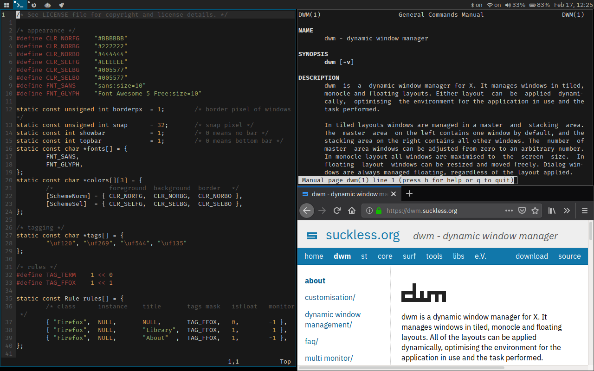

# My fork of dwm

Forked from [https://git.suckless.org/dwm/](https://git.suckless.org/dwm/) with my patches:

* [tagIndicator](https://github.com/icanalesm/dwm/tree/tagIndicator)
* [layoutfirst](https://github.com/icanalesm/dwm/tree/layoutfirst)
* [notitle](https://github.com/icanalesm/dwm/tree/notitle)
* [fixMemoryLeak](https://github.com/icanalesm/dwm/tree/fixMemoryLeak)




## Requirements

In order to build dwm, the libX11, libXft and libXinerama header files are required.

## Installation

```
git clone https://github.com/icanalesm/dwm.git
cd dwm
make
sudo make install
```


## Execution

Add the following line at the end of `~/.xinitrc` to start dwm using `startx`:
```
exec dwm
```


## My customisation

My [dotfiles repo](https://github.com/icanalesm/dotfiles) contains the scripts used in `config.h`, files for setting terminal colors, default fonts and my `.xinitrc` file, among other things.

In `config.h`:

* Fonts
  - Tags and layout: [Font Awesome](https://github.com/FortAwesome/Font-Awesome) (to get the codes, [search icons](https://fontawesome.com/icons))
* Key bindings
  - `dmenu`: [my fork of dmenu](https://github.com/icanalesm/dmenu)
  - Terminal: [my fork of st](https://github.com/icanalesm/st)
  - Volume control: `pactl` via [uictl](https://github.com/icanalesm/uictl)
  - Backlight control: [brightctl](https://github.com/icanalesm/brightctl) via [uictl](https://github.com/icanalesm/uictl)
  - Status: [tstat](https://github.com/icanalesm/tstat) via [uictl](https://github.com/icanalesm/uictl)
  - Screenshots: [my script](https://github.com/icanalesm/dotfiles/blob/master/.local/bin/scrshot) (requires [ImageMagick](https://www.imagemagick.org/))
  - Monitor configuration: [my script](https://github.com/icanalesm/dotfiles/blob/master/.local/bin/monctl)

Useful tools for configuration:

* `xev` to get the key codes for multimedia keys.
* `xfontsel` to get the name of fonts.
* `xfd` to get the unicode code of characters.
* `xprop` to get properties of clients for [dwm rules](https://dwm.suckless.org/customisation/rules).

Notice that `tstat` only sets or prints to stdout the status. I manually update the status bar by pressing `MODKEY`+`Shift`+`b`. To automatically update the status, `tstat` can be put in a shell script:
```
while true; do
	tstat set
	sleep 1
done
```
